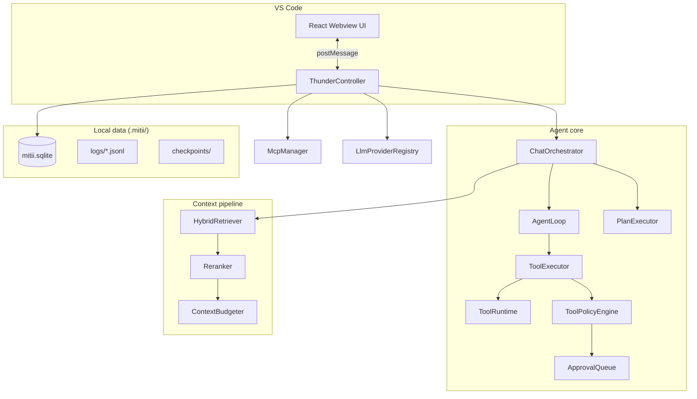

# Architecture

Mitii is a VS Code extension with a local agent core — **no central server required**. All workspace intelligence lives in `.mitii/` on your machine.

## System diagram



## Component responsibilities

| Component | Role |
|-----------|------|
| **ThunderController** | Central orchestrator — wires services, handles webview messages, workspace reload |
| **ChatOrchestrator** | Turn pipeline: retrieve → prompt → plan or agent loop → verify |
| **AgentLoop** | LLM ↔ tool round-trip in Agent mode |
| **PlanExecutor** | Multi-step planner in Plan mode |
| **HybridRetriever** | Merges FTS, vectors, rules, git, diagnostics, memory |
| **ContextBudgeter** | Fits context into model token window |
| **ToolPolicyEngine** | allow / require_approval / block per tool |
| **ApprovalQueue** | Pending human approvals |
| **CheckpointService** | Git-stash or file-copy snapshots |
| **MemoryService** | Long-term observations store |
| **McpManager** | Stdio / SSE / HTTP MCP connections |
| **LlmProviderRegistry** | Resolves provider by type and mode |

## Request lifecycle

1. User sends message in sidebar webview
2. **ThunderSession** mode (`ask` | `plan` | `agent` | `review`) selects tool policy
3. **HybridRetriever** gathers context from tiered sources (parallel, 800ms timeout each)
4. **Reranker** trims candidates; **ContextBudgeter** allocates token budget
5. **TaskAnalyzer** decides planner vs direct agent path
6. **resolveProviderForMode** picks plan or act model if configured
7. **AgentLoop** streams LLM → tool calls → policy → approval → execute → repeat
8. Results persisted: turns, plans, checkpoints, memory, JSONL logs

## Data storage (`.mitii/`)

| Path | Purpose |
|------|---------|
| `mitii.sqlite` | FTS index, symbols, vectors, sessions, memory, plans, checkpoints |
| `lance/` | LanceDB vectors (optional backend) |
| `logs/*.jsonl` | Structured session audit logs |
| `checkpoints/` | File-copy checkpoint snapshots |
| `tasks/` | Persisted plan JSON per session |
| `mcp.json` | Workspace MCP server definitions |
| `skills/` | User `SKILL.md` skill files |
| `diff-preview/` | Temporary diff preview files |

Legacy `.thunder/` paths are ignored for backward compatibility. **Nothing is sent to a Mitii server** — there isn't one.

## Source layout

| Directory | Role |
|-----------|------|
| `src/extension.ts` | VS Code activation entry |
| `src/core/` | Agent loop, indexing, retrieval, tools, safety, MCP, memory |
| `src/core/llm/` | Provider implementations (OpenAI, Anthropic, Gemini, etc.) |
| `src/core/agent/` | AgentLoop, PlanExecutor, ResearchAgent, compaction |
| `src/core/indexing/` | SQLite, FTS5, tree-sitter, vectors |
| `src/core/context/` | HybridRetriever, budgeter, repo map, sources |
| `src/vscode/` | Commands, webview provider, inline diff, diff preview |
| `src/webview-ui/` | React sidebar (Vite build → `dist/webview/`) |
| `src/shared/` | Brand constants |

## Webview UI

React app with:

- Chat, History, Settings tabs
- Plan panel, approval cards, agent activity
- Context debugger, memory browser, checkpoint browser
- Token meter, indexing status, context warnings

Communicates via typed `postMessage` protocol (`messages.ts`).

## LLM providers

`LlmProviderRegistry` resolves from `thunder.provider.type`:

- Native: **Anthropic** (Messages API), **Gemini** (GenerateContent API)
- OpenAI-compatible: OpenAI, DeepSeek, Cursor, Codex, Ollama, vLLM
- **Echo** stub for testing

Optional plan/act model overrides per mode.

## MCP architecture

```
McpManager
  ├─ StdioClientTransport (npx servers)
  ├─ SSEClientTransport (remote SSE)
  └─ StreamableHTTPClientTransport (remote HTTP)
       └─ tools registered as mcp__server__tool
```

## Safety layer

Every tool call: `ToolExecutor` → `ToolPolicyEngine` → `ApprovalQueue` (if needed) → execute.

Autonomy presets and approval modes compose to control writes, shell, and network.

## Build pipeline

| Target | Tool | Output |
|--------|------|--------|
| Extension host | esbuild | `dist/extension.js` |
| Webview | Vite + React | `dist/webview/` |

See [Development](/development) for build commands and [Implementation guides](/implementation/recent-improvements) for recent changes.
