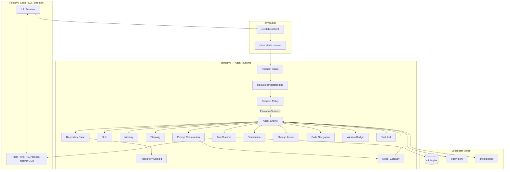

# Architecture

Mitii is a **host-neutral coding-agent runtime**. It works the same way whether you're using it from VS Code, a terminal, or a script.

```text
Validated Input → Cohesive Pipeline → Validated Result
```

The core (`@mitii/v8`) is framework-agnostic. Hosts inject ports (filesystem, process, network) and render structured events. All workspace intelligence lives in `.mitii/` on your machine — **no central server, no cloud dependency**.

## How it fits together


```mermaid
flowchart TB
  subgraph Host["Host (VS Code / CLI / Daemon)"]
    UI[UI / Terminal]
    PORTS["Host Ports: FS, Process, Network, Git"]
    UI <--> PORTS
  end

  subgraph SDK["@mitii/sdk"]
    CLIENT[createMitiiClient]
    START["client.start / resume"]
    CLIENT --> START
  end

  subgraph V8["@mitii/v8 — Agent Runtime"]
    INTAKE[Request Intake]
    UNDERSTAND[Request Understanding]
    DP[Decision Policy]
    AE[Agent Engine]
    REPO[Repository State]
    CTX[Repository Context]
    SKILLS[Skills]
    MEM[Memory]
    PLAN[Planning]
    PROMPT[Prompt Construction]
    MODEL[Model Gateway]
    TR[Tool Runtime]
    VERIFY[Verification]
    CI[Change Impact]
    CN[Code Navigation]
    BUDGET[Window Budget]
    TASK[Task List]
  end

  subgraph Data["Local data (.mitii/)"]
    SQL[(mitii.sqlite)]
    LOGS[logs/*.jsonl]
    CP[checkpoints/]
  end

  UI --> CLIENT
  START --> INTAKE --> UNDERSTAND --> DP
  DP -->|ExecutionDecision| AE
  AE --> REPO --> CTX
  AE --> SKILLS
  AE --> MEM
  AE --> PLAN
  AE --> BUDGET
  AE --> PROMPT --> MODEL
  MODEL --> AE
  AE --> TR
  TR --> PORTS
  AE --> VERIFY
  AE --> CI
  AE --> CN
  AE --> TASK
  TR --> SQL
  AE --> LOGS
  AE --> CP
```

## What each module does

| Module | What it does |
|--------|-------------|
| **Request Intake** | Validates your input, normalizes attachments and conversation metadata into a clean request envelope |
| **Request Understanding** | Figures out what you actually want — intent, targets, constraints, scope, risk, and whether clarification is needed |
| **Decision Policy** | The authority module. Converts understanding into one `ExecutionDecision`: which route to take, how deep to plan, what tools are allowed, and what needs approval |
| **Agent Engine** | The orchestrator. Sequences every stage of a run, manages the model/tool loop, handles suspension/resume, checkpoints, and emits structured events |
| **Repository State** | Builds and maintains the single authoritative index of your codebase — discovery, ignore rules, project catalog, FTS, vectors, symbols, and the dependency graph |
| **Repository Context** | Retrieves the most relevant code for a query within a token budget — hybrid search, deduplication, diversity selection, and safe assembly |
| **Skills** | Selects and budgets instruction blocks (SKILL.md files) that guide the agent's behavior for the current task |
| **Memory** | Durable facts scoped to user / workspace / project. Supplies prior preferences and decisions to prompt construction |
| **Planning** | Drafts a dimension-driven plan (scope, risk, complexity) when the decision calls for it. Validates, compacts, and serializes the result |
| **Task List** | Maintains a compact working checklist (max 8 items) derived from the plan. Tracks progress without stamping items done prematurely |
| **Prompt Construction** | Assembles the final model prompt from context, memory, skills, task context, and the window budget — with provenance and an omission report |
| **Window Budget** | Computes the usable input/output split from the model's context window, reserving space for output, mutations, planning, skills, and compaction |
| **Model Gateway** | Provider-agnostic LLM streaming (Anthropic, OpenAI, Gemini, OpenAI-compatible). Handles capability negotiation, usage tracking, and retry classification |
| **Tool Runtime** | The enforcement layer. Validates every tool call against the `ToolGrant`, executes via host ports, sanitizes output, enforces timeouts, and supports mutation rollback |
| **Verification** | Runs applicable checks (lint, typecheck, tests) after changes. Only Verification can authorize `verified_success` — the model cannot self-certify |
| **Change Impact** | Blast-radius estimation. Walks the repository graph from a file, symbol, or caret to find affected callers, importers, and package dependents |
| **Code Navigation** | Read-only source navigation — resolves definitions, references, and hover info via language server or repository graph |

## A run, step by step

1. **You send a prompt** (sidebar, terminal, or SDK `client.start()`)
2. **Request Intake** validates and normalizes it
3. **Request Understanding** extracts intent, scope, risk, and clarity
4. **Decision Policy** emits the `ExecutionDecision` — route, plan depth, tool grants, approval gates
5. **Agent Engine** pins repository state and coordinates the run
6. **Repository State** + **Repository Context** provide indexed, budgeted code context
7. **Skills**, **Memory**, and **Planning** contribute instructions and durable facts
8. **Window Budget** computes the token split; **Prompt Construction** assembles the final prompt
9. **Model Gateway** streams the response; tool calls route to **Tool Runtime**
10. **Tool Runtime** validates, executes, and returns bounded results
11. **Agent Engine** enforces budgets, persists checkpoints at gates, and emits `RunEvent`s
12. **Verification** runs checks and produces the final result state

### Run states

```text
Active:     received → understood → decided → context_ready → model_running ⇄ tool_running → verifying
Suspended:  clarification_required | approval_required
Terminal:   completed | approval_denied | cancelled | budget_exhausted | failed
```

## What V8 deliberately does NOT do

- Treat the model as an authority for permissions or completion
- Create one module per class, algorithm, or provider
- Put business logic in host wiring (VS Code, CLI, webview)
- Assume one language, package manager, or IDE
- Run all tests or load all context for every request
- Introduce multi-agent orchestration before one agent is reliable

## Data storage (`.mitii/`)

| Path | Purpose |
|------|---------|
| `mitii.sqlite` | FTS index, symbols, vectors, sessions, memory, plans, checkpoints |
| `lance/` | LanceDB vectors (optional backend) |
| `logs/*.jsonl` | Structured session audit logs |
| `checkpoints/` | File-copy checkpoint snapshots |
| `tasks/` | Persisted plan JSON per session |
| `mcp.json` | Workspace MCP server definitions |
| `skills/` | User `SKILL.md` skill files |
| `diff-preview/` | Temporary diff preview files |

Legacy `.thunder/` paths are ignored for backward compatibility. **Nothing is sent to a Mitii server** — there isn't one.

## Package layout

| Package | Role |
|---------|------|
| `packages/v8/` (`@mitii/v8`) | Core agent runtime — all 17 modules above |
| `packages/sdk/` (`@mitii/sdk`) | Host-neutral programmatic API — `createMitiiClient()`, `client.start()`, `client.resume()`, `run.events`, `run.result` |
| `packages/host/` (`@mitii/host`) | Host adapters — filesystem checkpoints, skills catalog, search, indexing, bundled embeddings |
| `apps/vscode/` | VS Code extension — sidebar webview, inline diff, diff preview, commands, settings UI |
| `apps/cli/` | Terminal agent — interactive and non-interactive modes |
| `apps/daemon/` | Background daemon — long-running indexing, session management, MCP server hosting |

Dependency direction: **`apps → sdk → v8`**. V8 never imports host or SDK packages.

## Source layout (V8 core)

All modules live under `packages/v8/src/modules/`:

```text
packages/v8/src/
├── modules/
│   ├── request-intake/
│   ├── request-understanding/
│   ├── repository-state/
│   ├── repository-context/
│   ├── decision-policy/
│   ├── prompt-construction/
│   ├── model-gateway/
│   ├── tool-runtime/
│   ├── verification/
│   ├── agent-engine/
│   ├── skills/
│   ├── memory/
│   ├── planning/
│   ├── task-list/
│   ├── code-navigation/
│   ├── change-impact/
│   └── window-budget/
├── engine/
│   ├── agent-engine/      (runtime orchestration)
│   └── tool-runtime/      (tool execution)
└── contracts/             (shared types across modules)
```

Each module follows a consistent internal shape:

```text
modules/<name>/
├── contracts/       (input, output, error, port schemas)
├── pipeline/        (public orchestration)
├── actions/         (meaningful pipeline steps)
└── internal/        (private implementation)
```

## Webview UI

React app with:

- Chat, History, Settings tabs
- Plan panel, approval cards, agent activity
- Context debugger, memory browser, checkpoint browser
- Token meter, indexing status, context warnings

Communicates via typed `postMessage` protocol.

## LLM providers

Configured via `mitii.provider.type`:

- **Native**: Anthropic (Messages API), Gemini (GenerateContent API)
- **OpenAI-compatible**: OpenAI, DeepSeek, Cursor, Codex, Ollama, vLLM
- **Echo** stub for testing

Optional plan/act model overrides per mode.

## MCP architecture

```
McpManager
  ├─ StdioClientTransport (npx servers)
  ├─ SSEClientTransport (remote SSE)
  └─ StreamableHTTPClientTransport (remote HTTP)
       └─ tools registered as mcp__server__tool
```

## Safety layer

Every tool call goes through **Tool Runtime**: validate against `ToolGrant` → execute via host ports → return bounded `ToolResult`.

Autonomy presets and approval modes compose to control writes, shell, and network. Only **Verification** can declare success — the model proposes, Verification disposes.

## Build pipeline

| Target | Tool | Output |
|--------|------|--------|
| Extension host | esbuild | `dist/extension.js` |
| Webview | Vite + React | `dist/webview/` |

See [Development](/development) for build commands and [Implementation guides](/implementation/recent-improvements) for recent changes.
