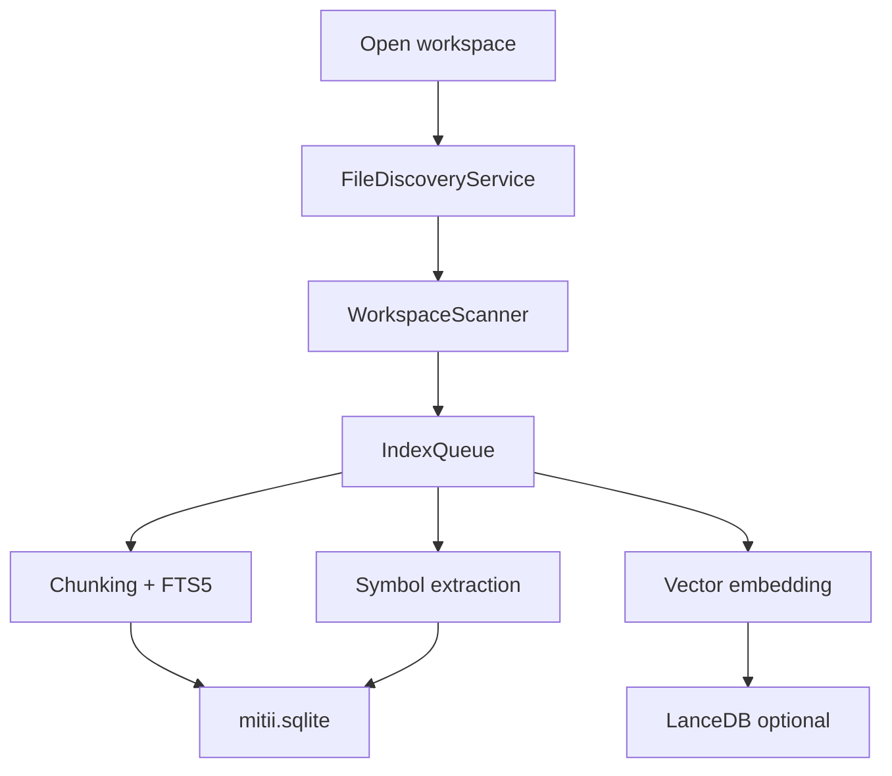

# Context & indexing

Mitii builds a local search index so the agent understands your repo before editing.

## Indexing pipeline

1. **Discovery** — scan files respecting `.gitignore` and `.mitiiignore`
2. **Diff** — compare hash/mtime against SQLite `files` table
3. **Queue** — parallel workers (default concurrency: 2)
4. **Per file** — chunk → FTS index → tree-sitter symbols → optional vectors

## Settings

| Setting | Default | Description |
|---------|---------|-------------|
| `thunder.indexing.enabled` | `true` | Master switch |
| `thunder.indexing.autoIndexOnOpen` | `true` | Index on folder open |
| `thunder.indexing.maxFileSizeBytes` | `512000` | Full index up to this size |
| `thunder.indexing.hardSkipSizeBytes` | `2000000` | Skip larger files entirely |
| `thunder.indexing.vectorsEnabled` | `true` | Semantic vectors |
| `thunder.indexing.embeddingProvider` | `minilm` | `minilm` or `hash` fallback |
| `thunder.indexing.vectorBackend` | `sqlite` | `sqlite` or `lancedb` |
| `thunder.indexing.treeSitterEnabled` | `true` | WASM symbol extraction |

## Retrieval sources

**HybridRetriever** queries sources in parallel (800ms timeout each):

| Tier | Sources |
|------|---------|
| Explicit | Project rules, `@` mentions, skills catalog |
| Editor | Current file, open files, workspace overview |
| Workspace | Git diff, LSP diagnostics |
| Search | FTS, indexed file search, vectors, repo map, memory |

Toggle sources in **Settings → Context**.

## Reranker & budgeter

1. **Reranker** — top 20 candidates → top 8 (`thunder.context.rerankerTopK`)
2. **ContextBudgeter** — allocate tokens per source within model window
3. **Dropped items** — surfaced in context debugger and warning banner

## Context debugger

Expand **Retrieved context** in the chat sidebar to see:

- Retrieved vs included token counts
- Per-source breakdown (FTS, vectors, rules, git, etc.)
- Included snippets with paths and reasons
- Dropped items with cause (`over_budget`, `not_selected`)

## Pinned context

- Add files/folders via `@` mentions or context picker
- Pinned items always considered for retrieval
- Shown in **Pinned context** panel above chat

## Built-in retrieval tools

| Tool | Purpose |
|------|---------|
| `search` | FTS / ripgrep query |
| `search_batch` | Multiple queries at once |
| `retrieve_context` | On-demand hybrid retrieval |
| `repo_map` | PageRank-weighted file listing |
| `list_files` | Directory listing |
| `read_file` / `read_files` | File contents |

## Repo map

PageRank over import/symbol graph highlights structurally central files — useful when the agent doesn't know where to start.

## Ignore files

- `.gitignore` — respected by default
- `.mitiiignore` — additional Mitii-specific ignores
- Legacy `.thunderignore` still honored

## Manual re-index

- Click indexing status in sidebar toolbar
- Command: **Mitii: Index Workspace**
- Force re-index after large refactors

## Storage

| Path | Contents |
|------|----------|
| `.mitii/mitii.sqlite` | FTS, symbols, vectors (sqlite backend), sessions |
| `.mitii/lance/` | Vector data when `vectorBackend: lancedb` |

Nothing is uploaded to external index services.
