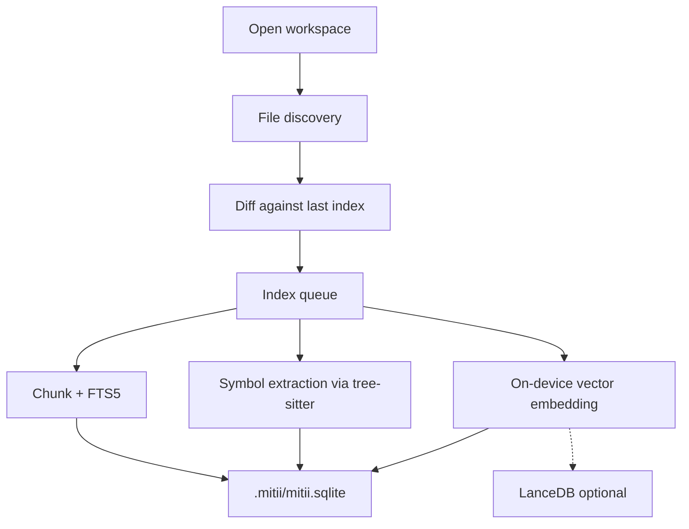

# Context & indexing

Mitii builds a local search index so the agent understands your repo before editing. All indexing runs on your machine — nothing is uploaded to external services.

## How it works

```mermaid
flowchart TD
  A[Open workspace] --> B[File discovery]
  B --> C[Diff against last index]
  C --> D[Index queue]
  D --> E[Chunk + FTS5]
  D --> F[Symbol extraction via tree-sitter]
  D --> G[On-device vector embedding]
  E --> H[.mitii/mitii.sqlite]
  F --> H
  G --> H
  G -.-> I[LanceDB optional]
```

1. **Discovery** — scan files, respecting `.gitignore` and `.mitiiignore`
2. **Diff** — compare hash/mtime against the SQLite `files` table to find what changed
3. **Queue** — parallel workers (default concurrency: 2) process new/changed files
4. **Per file** — chunk → full-text index → tree-sitter symbols → optional vectors

## Large-repo indexing

For big repositories the pipeline exposes three explicit phases so the UI can show progress and you can cancel at any time:

| Phase | What happens | Status values |
|-------|-------------|---------------|
| **Scan** | File discovery + diff; no indexing yet | `scanning` → `scan_complete` |
| **Index** | Chunking, FTS, symbols, vectors | `indexing` → `index_complete` |
| **Cancel** | User-initiated stop | `cancelled` |

If indexing is interrupted or a file exceeds size limits, the index enters **partial-index** status: already-indexed files remain searchable and the agent operates in a "degraded but usable" mode rather than blocking.

## Embeddings

Vector embeddings are produced **on-device** by the bundled embedding host. It generates `EmbeddingProvider` vectors without calling your chat-model provider — no extra API costs, no network round-trips.

| Option | Description |
|--------|-------------|
| `minilm` (default) | Small local model; good balance of quality and speed |
| `hash` | Deterministic fallback when no model is available |

Vector storage backend:

| Backend | Storage |
|---------|---------|
| `sqlite` (default) | Vectors stored in `.mitii/mitii.sqlite` |
| `lancedb` | Vectors stored in `.mitii/lance/` (optional, for very large repos) |

## Settings

| Setting | Default | What it does |
|---------|---------|-------------|
| `mitii.indexing.enabled` | `true` | Master switch for the index |
| `mitii.indexing.autoIndexOnOpen` | `true` | Index automatically when you open a folder |
| `mitii.indexing.maxFileSizeBytes` | `512000` | Index files up to this size (~500 KB) |
| `mitii.indexing.hardSkipSizeBytes` | `2000000` | Skip files larger than this (~2 MB) entirely |
| `mitii.indexing.vectorsEnabled` | `true` | Enable semantic vector search |
| `mitii.indexing.embeddingProvider` | `minilm` | `minilm` or `hash` fallback |
| `mitii.indexing.vectorBackend` | `sqlite` | `sqlite` or `lancedb` |
| `mitii.indexing.treeSitterEnabled` | `true` | WASM-based symbol extraction |

## Retrieval

When the agent needs context, the **Repository Context** module queries multiple sources in parallel (800 ms timeout each):

| Tier | Sources |
|------|---------|
| **Explicit** | Project rules, `@` mentions, skills catalog |
| **Editor** | Current file, open files, workspace overview |
| **Workspace** | Git diff, LSP diagnostics |
| **Search** | Full-text search, indexed file search, vectors, repo map, memory |

Toggle individual sources in **Settings → Context**.

### Reranking & budgeting

1. **Reranker** — narrows top 20 candidates down to top 8 (`mitii.context.rerankerTopK`)
2. **Window budget** — allocates tokens per source within the model's context window
3. **Dropped items** — anything that doesn't fit is surfaced in the context debugger with a reason

## Context debugger

Expand **Retrieved context** in the chat sidebar to see:

- Retrieved vs included token counts
- Per-source breakdown (FTS, vectors, rules, git, etc.)
- Included snippets with file paths and inclusion reasons
- Dropped items with cause (`over_budget`, `not_selected`)

## Pinned context

- Add files or folders via `@` mentions or the context picker
- Pinned items are always considered during retrieval
- Shown in the **Pinned context** panel above the chat input

## Built-in retrieval tools

The agent can call these tools during a run:

| Tool | What it does |
|------|-------------|
| `search` | Full-text / ripgrep query across the workspace |
| `search_batch` | Run multiple search queries at once |
| `retrieve_context` | On-demand hybrid retrieval (FTS + vectors) |
| `repo_map` | PageRank-weighted file listing for structural overview |
| `list_files` | Directory listing |
| `read_file` / `read_files` | Read file contents |
| `propose_file_scope` | Declare candidate file paths before reading or editing (default in Act mode) |

## Repo map

PageRank over the import/symbol graph highlights structurally central files — useful when the agent doesn't know where to start exploring.

## Ignore files

| File | Purpose |
|------|---------|
| `.gitignore` | Respected by default |
| `.mitiiignore` | Additional Mitii-specific ignores |
| `.thunderignore` | Legacy — still honored for backward compatibility |

## Manual re-index

- Click the indexing status chip in the sidebar toolbar
- Command palette: **Mitii: Index Workspace**
- Useful after large refactors or when you add new directories

## Storage

| Path | Contents |
|------|----------|
| `.mitii/mitii.sqlite` | FTS index, symbols, vectors (sqlite backend), sessions |
| `.mitii/lance/` | Vector data when `vectorBackend: lancedb` |

Everything stays local. No external index services are called.

## Where it lives in the codebase

| Package | Responsibility |
|---------|---------------|
| `@mitii/host` | Filesystem adapters, workspace indexing pipeline, tree-sitter runtime, bundled embeddings |
| `@mitii/v8` | Repository Context module (retrieval, reranking, budgeting), code-navigation, change-impact |
| `@mitii/sdk` | Public API surface for custom hosts |

The host owns the "how to scan and index" logic; V8 owns the "how to retrieve and rank" logic. This separation means the same index works across VS Code, CLI, and any custom host built on `@mitii/sdk`.
