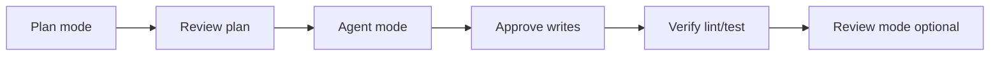
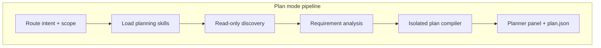

# Plan / Act workflow

Mitii separates **analysis** from **execution** so you can review a plan before any file changes.

## Modes

| Mode | Internal key | Writes | Shell |
|------|--------------|--------|-------|
| Ask | `ask` | No | Read-only only |
| Plan | `plan` | No | Read-only only |
| Agent | `agent` | Yes (policy) | Yes (policy) |
| Review | `review` | No | Read-only only |

Switch modes from the chat input toolbar. Legacy `act` maps to `agent`.

## Typical workflow



1. **Plan** — describe the feature; agent retrieves context and outputs a structured plan
2. **Review plan** — read steps in the Plan panel; adjust scope in chat if needed
3. **Agent** — ask to execute; tool loop runs with approvals
4. **Approve** — accept or reject each write/patch/shell via approval cards
5. **Verify** — optional `thunder.agent.verifyCommands` run after Act completes
6. **Review** — ask for a read-only review of changes

## Plan engine

When `thunder.agent.orchestrationEnabled` is true (default):

- **PlanExecutor** runs multi-phase steps: diagnostics → review → execute → verify
- Steps have status: `pending`, `running`, `done`, `blocked`, `failed`
- Plans persist to SQLite `task_plans` and `.mitii/tasks/<id>/plan.json`
- Plan tools: `mark_step_complete`, `propose_plan_mutation`

**Planning skills** — for structured plans, Mitii auto-loads workspace playbooks from `.mitii/skills/`:

| Skill | When loaded |
|-------|-------------|
| `using-agent-skills` | Every orchestrated plan |
| `planning-and-task-breakdown` | Every orchestrated plan |
| `audit-cleanup` | Audit / cleanup tasks |
| `debugging-and-error-recovery` | Bugfix / debug tasks |

Skill content is injected into discovery, requirement analysis, and isolated plan compilation. The Planner panel shows applied skills, requirement analysis, phased steps, tools, and success criteria (Cursor-style).

**TaskAnalyzer** decides whether to use the planner or a faster direct agent path in Agent mode.



## Plan vs Act models

Use different models for planning and implementation:

```json
{
  "thunder.provider.model": "qwen3-coder:30b",
  "thunder.agent.planModel": "qwen3.5:4b",
  "thunder.agent.actModel": "qwen3-coder:30b"
}
```

Optional `planBaseUrl` / `actBaseUrl` override the main provider URL per mode.

## Orchestration settings

| Setting | Default | Description |
|---------|---------|-------------|
| `thunder.agent.orchestrationEnabled` | `true` | Multi-step planner in Plan mode |
| `thunder.agent.maxSteps` | `15` | Max tool rounds per agent turn |
| `thunder.agent.autoContinue` | `true` | Continue after step limit |
| `thunder.agent.maxAutoContinues` | `2` | Max continuation rounds |
| `thunder.agent.verifyOnActComplete` | `true` | Run verify commands after Act |
| `thunder.agent.verifyCommands` | `["npm run lint", "npm test"]` | Commands to run |

## Research subagents

`spawn_research_agent` launches read-only parallel workers for exploration:

- Config: `thunder.agent.subagentsEnabled`, `researchAgentMaxSteps`, `researchAgentModel`
- Useful for broad audits before planning

## Task state across approvals

When the agent pauses for approval:

- **AgentTaskState** preserves progress
- **Approval checkpoints** inject an LLM summary on resume
- `save_task_state` tool for explicit mid-task saves

See [Safety](/implementation/safety) for approval policies.
