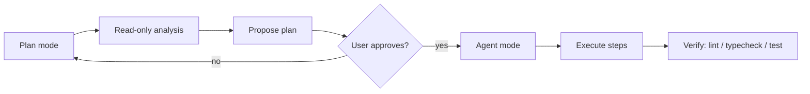

# Plan / Act workflow

Mitii separates **analysis** from **execution** so you can review a plan before any file changes. The V8 engine uses a three-layer architecture:

| Layer | Role |
|-------|------|
| **Agent Engine** | Orchestrates the run lifecycle: start, event streaming, checkpointing, suspend/resume, model/tool loop |
| **Decision Policy** | Converts request evidence into an `ExecutionDecision` — route (Ask / Plan / Act), whether planning is required, and which tools may run |
| **Tool Runtime** | Enforces every tool call against the current `ToolGrant` (allowed tools, maximum workspace effect, allowed effects) before execution |

## Skill routing

Before executing a plan, the Agent Engine routes the task through a **skill playbook** (`SKILL.md`). Skills are bundled in `packages/sdk/skills/` and loaded via `createFileSystemSkillsCatalog()`; workspace overrides live in `.mitii/skills/`. Each skill defines three phases:

| Phase | What happens |
|-------|-------------|
| **Planning** | Discover, decompose, and order tasks with acceptance criteria |
| **Change** | Implement with minimal, reviewable diffs |
| **Verify** | Prove the change with tests, typecheck, and lint |

Skills are composable: the agent selects the most relevant skill for the task (by intent, route, and priority) and follows its instruction blocks. Skills in the same `conflictGroup` are mutually exclusive — the highest-priority skill wins.

## Modes

| Mode | Route | Writes? | Tool scope |
|------|-------|---------|------------|
| **Ask** | `ask` | No | Read-only only |
| **Plan** | `plan` | No | Read-only + plan tools |
| **Agent** | `execute` | Yes | Full tool set (gated by `ToolGrant`) |
| **Review** | `review` | No | Read-only only |

Switch modes from the chat input toolbar. Legacy `act` maps to `agent`.

## Typical workflow

```mermaid
flowchart LR
  A[Plan mode] --> B[Read-only analysis]
  B --> C[Propose plan]
  C --> D{User approves?}
  D -- yes --> E[Agent mode]
  E --> F[Execute steps]
  F --> G[Verify: lint / typecheck / test]
  D -- no --> A
```

1. **Plan** — describe the feature; agent retrieves context and outputs a structured plan
2. **Review plan** — read steps in the Plan panel; adjust scope in chat if needed
3. **Agent** — ask to execute; tool loop runs with approvals
4. **Approve** — accept or reject each write/patch/shell via approval cards
5. **Verify** — optional `thunder.agent.verifyCommands` run after Act completes
6. **Review** — ask for a read-only review of changes

## Plan engine

- **Agent Engine** runs multi-phase steps: diagnostics → review → execute → verify
- Steps have status: `pending`, `running`, `done`, `blocked`, `failed`
- Plans persist to SQLite `task_plans` and `.mitii/tasks/<id>/plan.json`
- Plan tools: `mark_step_complete`, `propose_plan_mutation`
- **Decision Policy** decides whether to use the planner or a faster direct agent path in Agent mode. All tool calls — including plan tools — pass through the **Tool Runtime**, which validates each call against the current `ToolGrant` before execution and returns bounded results.

**Planning skills** — for structured plans, Mitii auto-loads bundled skills from `packages/sdk/skills/` (workspace overrides in `.mitii/skills/`):

| Skill | When loaded |
|-------|-------------|
| `planning-default` | Every orchestrated plan (baseline) |
| `planning-and-task-breakdown` | Feature / refactor / multi-step tasks |
| `safety-always` | Every run (always-apply) |
| `debugging-and-error-recovery` | Bugfix / debug tasks |
| `code-review-and-quality` | Review / quality tasks |
| `test-driven-development` | Test-heavy tasks |

## Plan vs Act models

| Aspect | Plan mode | Agent mode |
|--------|-----------|------------|
| Writes files | No | Yes (gated) |
| Tool scope | Read-only + plan tools | Full set via `ToolGrant` |
| Approval | User reviews plan | Per-step or batch approval |
| Checkpoints | N/A | Auto-checkpoint before mutations |
| Rollback | N/A | Revert to last checkpoint |

## Orchestration settings

| Setting | Default | Description |
|---------|---------|-------------|
| `mitii.agent.orchestrationEnabled` | `true` | Multi-step planner in Plan mode |
| `mitii.agent.maxSteps` | `15` | Max tool rounds per agent turn |
| `mitii.agent.autoContinue` | `false` | Auto-continue after approval |
| `mitii.agent.verifyCommands` | `["pnpm run lint", "pnpm test"]` | Commands to run |
| `mitii.agent.checkpointEnabled` | `true` | Auto-checkpoint before mutations |

## Research subagents

- `spawn_research_agent` — read-only subagent for parallel exploration
- Subagents inherit the parent `ToolGrant` minus write permissions
- Results are summarized back into the parent context

## Task state

- `AgentTaskState` tracks: current step, step status, tool history, checkpoint ID
- `save_task_state` persists state after each step for suspend/resume
- State is stored in SQLite and mirrored to `.mitii/tasks/<id>/state.json`

## Checkpoints and rollback

- Auto-checkpoint before each mutating tool call (when `checkpointEnabled` is true)
- Checkpoints capture: file diffs, git HEAD, task state
- Rollback reverts to the last checkpoint and restores task state
- Checkpoints are retained for the session lifetime

## Evidence and verification

- Every step produces evidence: tool output, diagnostics, test results
- Verification phase runs `verifyCommands` and reports pass/fail per command
- Failed verification blocks step completion and surfaces the error to the user
- Evidence is attached to the plan step for audit trail
