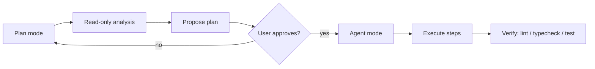

# Plan / Act workflow

Mitii separates **analysis** from **execution** so you can review a plan before any file changes are made. You describe what you want, the agent reads the repository and proposes a structured plan, and only after you approve does it start writing code. This keeps you in control while the agent handles the mechanical work.

## Modes

Mitii operates in four modes. You switch between them from the chat input toolbar.

| Mode | What it does | Writes files? | Tool access |
|------|-------------|---------------|-------------|
| **Ask** | Answers questions about your codebase | No | Read-only |
| **Plan** | Analyzes the task and proposes a step-by-step plan | No | Read-only + plan tools |
| **Agent** | Executes the plan, making file changes and running commands | Yes | Full tool set (gated by permissions) |
| **Review** | Performs a read-only review of existing changes | No | Read-only |

::: info
The legacy `act` mode name maps to `agent`.
:::

The key distinction: **Plan** and **Agent** are two halves of the same workflow. Plan mode produces a proposal; Agent mode carries it out. You can also use either independently — ask a question in Ask mode, or jump straight to Agent mode for a task you already understand.

## Typical workflow

A common end-to-end flow looks like this:



1. **Describe the task** (Plan mode) — Explain what you want in natural language. The agent reads relevant files, runs diagnostics, and outputs a structured plan with ordered steps.
2. **Review the plan** — Read the steps in the Plan panel. If the scope is too broad or missing something, adjust it in chat before proceeding.
3. **Execute** (Agent mode) — Ask the agent to execute. It works through the steps, making file edits and running commands. Each mutating action requires your approval via an approval card.
4. **Verify** — After execution, the agent runs your configured verification commands (lint, tests, typecheck) and reports pass/fail per command.
5. **Review** (optional) — Switch to Review mode for a read-only pass over the changes, or ask the agent to summarize what was done.

## How it works under the hood

The agent runtime is organized into three layers. Understanding them helps when you need to debug behavior or extend the system.

| Layer | Responsibility |
|-------|----------------|
| **Agent Engine** | Orchestrates the run lifecycle: starts the model/tool loop, streams events, manages checkpoints, and supports suspend/resume |
| **Decision Policy** | Converts your request and repository evidence into an `ExecutionDecision` — which route to take (Ask / Plan / Agent), whether planning is required, and which tools are permitted |
| **Tool Runtime** | Validates every tool call against the current permission grant before execution, then returns a bounded result |

The Decision Policy is the authority module: it decides *what* the agent is allowed to do. The Tool Runtime is the enforcement layer: it checks *each individual call* against that decision. Neither layer grants permissions on its own — the grant is always derived from the Decision Policy output.

### Plan engine

When the agent is in Plan mode with orchestration enabled, it runs a multi-phase pipeline:

```
diagnostics → review → execute → verify
```

Each step in the plan has a status: `pending`, `running`, `done`, `blocked`, or `failed`. Plans persist to SQLite (`task_plans` table) and are mirrored to `.mitii/tasks/<id>/plan.json` for inspection.

The Decision Policy can also choose a faster direct path in Agent mode when the task is simple enough that a full plan is unnecessary.

### Skills

Skills are reusable instruction playbooks (`SKILL.md` files) that shape how the agent approaches a task. They are bundled in `packages/sdk/skills/` and can be overridden per workspace in `.mitii/skills/`.

Each skill defines three phases:

| Phase | What happens |
|-------|-------------|
| **Planning** | Discover context, decompose the task, and order steps with acceptance criteria |
| **Change** | Implement with minimal, reviewable diffs |
| **Verify** | Prove the change with tests, typecheck, and lint |

The agent selects the most relevant skill for the current task based on intent, route, and priority. Skills in the same `conflictGroup` are mutually exclusive — the highest-priority skill wins.

**Auto-loaded planning skills:**

| Skill | When it loads |
|-------|---------------|
| `planning-default` | Every orchestrated plan (baseline) |
| `planning-and-task-breakdown` | Feature, refactor, or multi-step tasks |
| `safety-always` | Every run (always-apply) |
| `debugging-and-error-recovery` | Bugfix or debug tasks |
| `code-review-and-quality` | Review or quality tasks |
| `test-driven-development` | Test-heavy tasks |

## Safety mechanisms

### Checkpoints and rollback

Before each mutating tool call, the agent automatically creates a checkpoint (when `checkpointEnabled` is `true`). A checkpoint captures:

- File diffs at that point
- The current git HEAD
- Task state (current step, tool history)

If something goes wrong, you can roll back to the last checkpoint, which reverts file changes and restores task state. Checkpoints are retained for the session lifetime.

### Task state

The `AgentTaskState` object tracks the current step, step status, tool history, and checkpoint ID. It is persisted after each step via `save_task_state`, enabling suspend/resume across sessions. State lives in SQLite and is mirrored to `.mitii/tasks/<id>/state.json`.

### Research subagents

For tasks that require broad exploration (e.g., "find all usages of this API across the monorepo"), the agent can spawn a read-only research subagent via `spawn_research_agent`. The subagent:

- Inherits the parent's permissions minus write access
- Explores the repository in parallel
- Returns a summarized result back into the parent context

This keeps the main agent's context focused while still gathering the information it needs.

## Verification

Every step produces evidence: tool output, diagnostics, and test results. After execution completes, the verification phase runs your configured `verifyCommands` and reports pass/fail per command.

- A failed verification **blocks step completion** and surfaces the error to you.
- Evidence is attached to the plan step for the audit trail.

## Configuration

| Setting | Default | Description |
|---------|---------|-------------|
| `mitii.agent.orchestrationEnabled` | `true` | Enables the multi-step planner in Plan mode |
| `mitii.agent.maxSteps` | `15` | Maximum tool rounds per agent turn |
| `mitii.agent.autoContinue` | `false` | Auto-continue to the next step after approval |
| `mitii.agent.verifyCommands` | `["pnpm run lint", "pnpm test"]` | Commands to run during verification |
| `mitii.agent.checkpointEnabled` | `true` | Auto-checkpoint before each mutation |

## Plan vs Agent at a glance

| Aspect | Plan mode | Agent mode |
|--------|-----------|------------|
| Writes files | No | Yes (gated by permissions) |
| Tool scope | Read-only + plan tools | Full set via permission grant |
| Approval model | You review the full plan up front | Per-step or batch approval during execution |
| Checkpoints | N/A | Auto-checkpoint before each mutation |
| Rollback | N/A | Revert to last checkpoint |
