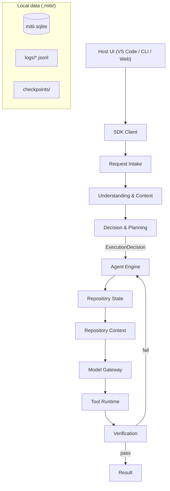

# Architecture

Mitii is a coding-agent runtime that turns your prompt into validated, verified code changes. It behaves identically whether you invoke it from the VS Code sidebar, a terminal, or a script.

```text
Validate → Understand → Plan → Execute → Verify → Report
```

## High-Level Overview



### Module Overview

| Module | What it does |
|--------|-------------|
| **Request Intake** | Validates incoming requests, resolves interaction mode, and builds the request envelope |
| **Understanding & Context** | Gathers repository context, memory, skills, and prior decisions to inform the plan |
| **Decision & Planning** | Produces an execution decision and step-by-step plan from the gathered context |
| **Agent Engine** | Orchestrates the model/tool loop, manages state, checkpoints, suspension/resume, and cancellation |
| **Repository State** | Converts mutable workspace observations into immutable published descriptions (the consistency authority) |
| **Repository Context** | Reads published state to provide file content, symbols, and search results to the model |
| **Model Gateway** | Manages LLM interactions — prompt construction, streaming, retries, and provider abstraction |
| **Tool Runtime** | Executes tools (file read/write, search, commands) with permission checks and sandboxing |
| **Verification** | Runs applicable checks (lint, typecheck, tests) after changes. Only Verification can authorize `verified_success` |
| **Prompt Construction** | Assembles the final model prompt from context, memory, skills, task context, and the window budget |
| **Window Budget** | Computes the token split across system prompt, context, tools, and response |
| **Skills** | Loads and applies project-specific `SKILL.md` instructions |
| **Memory** | Manages durable knowledge from prior sessions (SQLite-backed) |
| **Planning** | Maintains the step-by-step plan and tracks progress |
| **Checkpoints** | Creates file-copy snapshots for rollback |
| **MCP** | Hosts and communicates with Model Context Protocol servers |
| **Events** | Emits structured session events for audit and UI streaming |

### Local Data (`.mitii/`)

| Path | Purpose |
|------|---------|
| `mitii.sqlite` | FTS index, symbols, vectors, sessions, memory, plans, checkpoints |
| `lance/` | LanceDB vectors (optional backend) |
| `logs/*.jsonl` | Structured session audit logs |
| `checkpoints/` | File-copy checkpoint snapshots for rollback |
| `tasks/` | Persisted plan JSON per session |
| `mcp.json` | Workspace MCP server definitions |
| `skills/` | User `SKILL.md` skill files |
| `diff-preview/` | Temporary diff preview files |

### Package Layout

The project is a monorepo with a strict dependency direction: **`apps → sdk → v8`**. The core runtime never imports host or SDK packages.

| Package | Role |
|---------|------|
| `packages/v8/` (`@mitii/v8`) | Core agent runtime — all 17 modules described above |
| `packages/sdk/` (`@mitii/sdk`) | Host-neutral programmatic API — `createMitiiClient()`, `client.start()`, `client.resume()`, `run.events`, `run.result` |
| `packages/host/` (`@mitii/host`) | Shared host adapters — filesystem checkpoints, skills catalog, search, indexing, bundled embeddings |
| `apps/vscode/` | VS Code extension — sidebar webview, inline diff, diff preview, commands, settings UI |
| `apps/cli/` | Terminal agent — interactive and non-interactive modes |
| `apps/daemon/` | Background daemon — long-running indexing, session management, MCP server hosting |

```text
apps/vscode ──┐
apps/cli ─────┼──→ @mitii/sdk ──→ @mitii/v8
apps/daemon ──┘         │
                        └──→ @mitii/host (shared adapters)
```

### Source Layout (V8 core)

All modules live under `packages/v8/src/modules/`. Each module follows a consistent internal shape:

```text
modules/<name>/
├── contracts/       (input, output, error, port schemas)
├── pipeline/        (public orchestration)
├── actions/         (meaningful pipeline steps)
├── internal/        (private helpers, adapters)
└── README.md        (responsibility, I/O, stages, dependencies)
```

---

## V8 Architecture Specification

Status: target architecture and binding migration specification
Canonical code root: `packages/v8/src/`
Last reviewed: 2026-07-26

The key words **MUST**, **MUST NOT**, **SHOULD**, **SHOULD NOT**, and **MAY** are used as normative requirements in the sense of BCP 14.

## 1. Purpose

V8 is the host-neutral coding-agent runtime at the core of Mitii. It is the layer that turns a user request into a validated, evidence-backed result — independent of whether the request arrives through VS Code, the CLI, or a test harness. Every request flows through an explicit, validated pipeline:

```text
Validated Input → Cohesive Pipeline → Validated Result
```

In practice this means a request is normalized and validated before any work begins, processed by a small set of cohesive business modules (retrieval, decision-making, tool execution, verification), and only reported as complete when verification produces evidence that the work succeeded.

Its priorities are:

1. Correct, inspectable decisions instead of uncontrolled model judgment — every routing and permission decision is traceable to a policy, not a model guess.
2. One authoritative repository state for retrieval, editing, and verification, so all modules agree on what the workspace contains.
3. Strong repository understanding with bounded token use.
4. Safe execution with explicit capabilities, approvals, checkpoints, and evidence.
5. Generic operation across at least 15 languages without spreading language conditionals through the core.
6. A stable folder structure that makes a bug's owner identifiable quickly.

V8 is not a collection of every low-level capability as a public module. It is a small set of business facades containing cohesive actions and private implementation details.

## 2. Non-goals

V8 does not:

- Extend or depend on legacy implementations.
- Create one top-level module per class, algorithm, index, tool, or provider.
- Put business logic in VS Code, CLI, webview, or other host wiring.
- Assume one programming language, package manager, build system, model provider, or IDE.
- Treat the model as an authority for permissions or successful completion.
- Run all tests, load all context, or create a visible plan for every request.
- Introduce multi-agent orchestration before one agent is reliable.

## 3. System boundaries

The diagram below shows the three layers and how they relate. **Application hosts** are the surfaces a user interacts with (VS Code extension, CLI, tests). They own host-specific concerns — UI, secrets, persistence — and inject them into the runtime. The **Agent Engine** is the orchestrator inside V8: it sequences the business modules for a single run, manages the run state machine, and coordinates the model/tool loop. The **business modules** (request intake, repository state, tool runtime, and so on) are the stable public facades documented in the next section.

```text
Application Hosts
  VS Code | CLI | tests | future web/desktop
        │
        │ inject ports, secrets, UI, persistence
        â–¼
Agent Engine
  coordinates public V8 facades and run state
        │
        ├── Request Intake
        ├── Request Understanding
        ├── Decision Policy
        ├── Skills
        ├── Memory
        ├── Planning
        ├── Repository Context ── Repository State
        ├── Code Navigation
        ├── Prompt Construction
        ├── Model Gateway
        ├── Tool Runtime
        └── Verification
```

The Application layer MUST own host APIs, user-interface DTO mapping, secret retrieval, and adapter composition. V8 MUST remain usable in tests and a headless CLI.

Repository packaging (Roadmap Phases 10–13 for product packages; Phase 14 last for `tests/` / `fixtures/`) places this boundary in concrete packages:

- Runtime: `packages/v8` (`@mitii/v8`) — live root is `packages/v8/src/`
- Public API: `packages/sdk` (`@mitii/sdk`) — hosts and tests prefer this
- Hosts: `apps/vscode`, `apps/cli` (optional `apps/daemon`)
- Consumers: `tests/`, `fixtures/`

Authoritative packaging freeze (Phase 10): `docs/REPO_LAYOUT.md` and `docs/CAPABILITY_INVENTORY.md`.

Dependency direction MUST remain `apps → sdk → v8`. V8 MUST NOT import host or SDK packages.

Runtime orchestration belongs to `packages/v8/src/engine/agent-engine/` (or `packages/v8/.../engine/agent-engine/` after Phase 11). Tool execution
belongs to the tool-runtime engine package path. Business facades remain under
`modules/`.

## 4. Stable public modules

V8 exposes a fixed set of public modules. Each module is a **business facade**: it owns one distinct business outcome (for example, "publish a consistent view of the repository" or "execute an authorized tool call") and hides its internal implementation behind validated input/output contracts. The table below summarizes each module's input, output, and ownership boundaries. The "Must not own" column is the key architectural constraint — it prevents modules from drifting into each other's responsibilities.

| Module | Primary input → output | Owns | Must not own |
|---|---|---|---|
| `request-intake` | Raw host request → request envelope | Request validation, interaction mode, attachments/references, conversation metadata normalization | Intent, policy, retrieval |
| `request-understanding` | Envelope → understanding result | Intent evidence, targets, constraints, scope, complexity, risk, clarity, expected outcome, clarification assessment | Final route or authority |
| `repository-state` | Workspace change/sync request → published state descriptor | Discovery, ignore policy, project catalog, source analysis, indexes, graph, map, readiness, atomic state publication | Prompting or tool execution |
| `repository-context` | State reference + query + budget → context result | Hybrid retrieval, deduplication, diversity selection, representation choice, safe assembly | Re-indexing or model calls |
| `decision-policy` | Envelope + understanding + mode + state capability → execution decision | Route, planning depth, plan gate, context need, tool grant, approval and verification policy | Executing decisions |
| `prompt-construction` | Decision + context + conversation + selected instructions → model request | Total budget allocation, serialization, compaction, provenance, omission report | Retrieval or model invocation |
| `model-gateway` | Model invocation → model-event stream | Provider selection, capability negotiation, normalized streaming, usage, retry classification | Tool execution or run policy |
| `tool-runtime` | Authorized tool call → tool result | Tool catalog, schema validation, permissions, path/command/network enforcement, timeout, audit, mutation transaction | Choosing the task route |
| `verification` | Change/result + state + policy → verification result | Affected-project selection, applicable checks, diagnostics/diff evidence, completion recommendation | Direct shell bypass |
| `agent-engine` | Start/resume request → run handle | State machine, sequencing, model/tool loop, cancellation, suspension/resume, checkpoints, events, terminal result | Internals owned by other modules |
| `skills` | Task evidence + budget → selected instructions | Selection, conflicts, provenance, instruction budgeting | General prompt construction |
| `memory` | Scoped query/commit → memory result | Retrieval, relevance, retention, provenance, privacy | Run orchestration |
| `planning` | Task evidence + decision depth (+ optional skills/process hints) → `PlanArtifact` | Dimension-driven plan drafting, validation, compaction, serialization | Route authority, tool execution, hard-coded plan types |
| `task-list` | Plan artifact or apply input → live `TaskList` | Compact working checklist (max 8), derive pending tasks from a plan, markdown serialize/parse | Plan drafting, tool execution, host UI, stamping remaining items done when a run ends |
| `code-navigation` | Path + caret -> definitions / references / hover | Language-server and repo-graph navigation | Indexing, retrieval budgets, spawning servers |
| `change-impact` | Change seed + published `RepoGraph` → bounded impact report | Reverse-dependent blast radius (callers, importers, package dependents), truncation/staleness reason codes | Indexing, retrieval ranking, tool grants, planning dimensions |
| `window-budget` | Advertised context window + optional overrides → `WindowPolicy` | Proportional output reserve, usable-input split, mutation/planning/skills/run/compaction numbers | Prompt text, retrieval, grants, model calls |

Adding a top-level module requires all of:

1. A distinct business outcome stated in one sentence.
2. An independently useful public lifecycle and invariant set.
3. At least two real consumers or a firm phase requirement.
4. Evidence it cannot be a cohesive action/internal capability of an existing module.
5. An architecture decision and roadmap migration entry.

## 5. Module shape

Every module follows the same internal layout so that a bug's owner is identifiable quickly. Use the smallest subset of this structure that the module needs — not every folder is required:

```text
packages/v8/src/modules/<module-name>/
├── contracts/                 public boundary: what callers see
│   ├── input/                 boundary schemas and inferred input types
│   ├── output/                result schemas and inferred result types
│   ├── errors/                stable module errors/reason codes
│   └── ports/                 environmental dependency contracts
├── pipeline/                  public orchestration, when useful
├── actions/                   meaningful pipeline stages
├── internal/                  private algorithms and data structures
├── adapters/                  module-owned port implementations
├── tests/
│   ├── contract/
│   ├── unit/
│   └── integration/
├── constants.ts               optional stable constants/identifiers
├── defaults.ts                optional default configurable values
├── policy.ts                  optional thresholds and weights
├── patterns.ts                optional large rule/pattern catalogs
├── README.md
└── index.ts                   explicit public facade/contracts only
```

The key rule: `index.ts` is the only public entry point, and it re-exports facades and contracts only. Everything under `internal/`, `actions/`, and `adapters/` is private implementation that callers must not import directly.

Do not create empty directories. A small module may keep its primary facade at the module root and use fewer folders.

A module normally has 3–10 meaningful stages. This is a diagnostic range, not a quota. A three-stage `Retrieve → Select → Assemble` pipeline is valid. Artificial wrapper actions are not.

### Cohesion test

When deciding whether code belongs in a module, apply these tests:

**Keep code together when:**

- It contributes to one recognizable business result.
- It changes for the same domain reason.
- It shares invariants and lifecycle.
- Callers should not know the internal sequence.

**Split code when:**

- Outcomes are independently useful.
- Lifecycles, permissions, scaling, or failure boundaries differ.
- The current facade exposes unrelated operations.
- A change repeatedly requires editing unrelated areas.

## 6. Contracts and schema ownership

Boundary data MUST be validated at entry and exit. In TypeScript, Zod schemas are the runtime source of truth and compatible types SHOULD be inferred from them — this keeps the schema and the type from drifting apart:

```ts
export const PipelineInputSchema = z.object({
  schemaVersion: z.literal(1),
  requestId: z.string().min(1),
});

export type PipelineInput = z.infer<typeof PipelineInputSchema>;
```

Use hand-written types for internal functions, opaque handles, branded values, and types whose runtime representation is not the schema.

Every public result SHOULD contain, as applicable:

- `schemaVersion`
- stable identity/correlation fields
- status as a discriminated union
- evidence and provenance
- warnings and omissions
- stable reason/error codes
- timing and budget summary

The semantic owner defines a shared contract. Other modules import it through that owner's public entry point; V8 MUST NOT create a root `shared` bucket to avoid choosing ownership.

Contract compatibility follows explicit schema versions. Breaking public changes require a migration and public API version decision; released artifacts are never mutated in place.

## 7. Dependency rules

Allowed dependencies point inward to contracts and public facades:

```text
Application → Agent Engine → public V8 facades
Repository Context → Repository State public contracts/reader port
Verification → Tool Runtime public facade
All modules → their own contracts, actions, internals, adapters
```

Forbidden dependencies:

- Any V8 production import from legacy paths.
- A cross-module import from `actions/`, `internal/`, private adapters, or tests.
- Any pipeline importing Agent Engine.
- Repository modules importing Model Gateway, Prompt Construction, Verification, or Agent Engine.
- Model Gateway importing Tool Runtime.
- Prompt Construction executing tools or retrieval.
- Host APIs imported into a V8 business module.
- Cycles between public modules.

Application composition MAY provide one adapter object implementing several compatible ports. That does not move port ownership out of the consuming modules.

## 8. Public API policy

`packages/v8/src/index.ts` MUST use explicit named exports and expose only:

- Primary business facades.
- Public input/output schemas and types.
- Public port contracts needed by hosts/adapters.
- Stable public error/reason codes.

It MUST NOT export:

- Actions or internal algorithms.
- Parser/provider implementation classes.
- Concrete storage adapters unless intentionally part of the host integration API.
- Test fixtures.
- Wildcard barrels that accidentally expand the API.

Each module `README.md` records responsibility, input, output, stages, dependencies, public exports, failure modes, and “does not own.”

## 9. Repository State: the consistency authority

Repository State converts mutable workspace observations into immutable published descriptions.

```ts
interface RepositoryStateReference {
  workspaceId: string;
  stateToken: string;
}

interface RepositoryStateDescriptor {
  schemaVersion: number;
  workspaceId: string;
  stateToken: string;
  snapshotId: string;
  roots: RepositoryRootState[];
  readiness: "ready" | "degraded" | "unavailable";
  reasons: RepositoryStateReason[];
  generatedAt: string;
}

interface RepositoryRootState {
  rootId: string;
  projectCatalogRevision: string;
  codeIndexRevision?: string;
  textIndexRevision?: string;
  vectorProfile?: string;
  vectorIndexRevision?: string;
  graphRevision?: string;
  mapRevision?: string;
  capabilities: RepositoryCapabilityStatus[];
}
```

The exact schemas belong to `repository-state`; the interfaces above illustrate required meaning.

### Publication protocol

```text
Observe workspace
→ build candidate snapshot/catalog/index/graph/map artifacts
→ validate revision relationships and completeness
→ derive manifest and stateToken
→ atomically publish immutable descriptor
→ make it available to new runs
```

Rules:

- A run MUST pin one state reference.
- Context, patch preflight, and verification MUST use the pinned state or explicitly refresh through policy.
- A filtered, truncated, failed, or cancelled scan MUST NOT delete unseen facts.
- State readers MUST reject unknown tokens and expose degraded capabilities.
- Background publication MUST NOT mutate an already published state.
- Storage cleanup MUST retain states needed by active runs/checkpoints.
- Multi-root state MUST preserve root identity and per-root revisions.

## 10. Language and project architecture

V8's implementation language is TypeScript; the repositories it understands are not.

### Capability model

Every source artifact receives baseline support:

1. Discovery and ignore policy.
2. Encoding/size/binary classification.
3. Language evidence and normalized language ID.
4. Deterministic text chunking fallback.
5. Lexical indexing/search.
6. Sensitive-path filtering and secret redaction.
7. Context assembly with provenance.

Enhanced capabilities are negotiated independently:

- Syntax parsing.
- Symbol/import/call/reference extraction.
- LSP diagnostics/navigation.
- Semantic embeddings.
- Project/build/test/lint discovery.
- Safe edit/format support.

Each capability reports `available`, `degraded`, or `unavailable` plus provider and reason. No module assumes that parsing implies LSP, or that a detected language implies a working compiler.

### Target language matrix

| Language | Common evidence | Target semantic providers | Project/verification evidence |
|---|---|---|---|
| TypeScript | `.ts`, `.tsx`, `tsconfig.json` | TypeScript compiler API, Tree-sitter, LSP | `package.json` scripts, lockfile, config |
| JavaScript | `.js`, `.jsx`, `.mjs`, `.cjs`, `jsconfig.json` | TypeScript/JS services, Tree-sitter, LSP | `package.json` scripts, lockfile |
| Python | `.py`, `pyproject.toml` | Tree-sitter, Python LSP/AST adapter | `pyproject.toml`, lockfiles, tool sections |
| Java | `.java`, `pom.xml`, Gradle files | Tree-sitter, Java LSP/compiler adapter | Maven/Gradle project declarations |
| C# | `.cs`, `.csproj`, `.sln` | Tree-sitter, Roslyn/LSP adapter | solution/project files |
| Go | `.go`, `go.mod` | Tree-sitter, Go parser/LSP | module/workspace files |
| Rust | `.rs`, `Cargo.toml` | Tree-sitter, rust-analyzer adapter | Cargo manifest/workspace |
| C | `.c`, `.h`, compile database | Tree-sitter, Clang/LSP adapter | CMake/Meson/Make/compile commands |
| C++ | `.cc`, `.cpp`, `.cxx`, headers | Tree-sitter, Clang/LSP adapter | CMake/Meson/Make/compile commands |
| Ruby | `.rb`, `Gemfile`, gemspec | Tree-sitter, Ruby LSP adapter | Bundler/Rake configuration |
| PHP | `.php`, `composer.json` | Tree-sitter, PHP LSP adapter | Composer scripts/config |
| Kotlin | `.kt`, `.kts`, Gradle/Maven files | Tree-sitter, Kotlin LSP/compiler adapter | Gradle/Maven project declarations |
| Swift | `.swift`, `Package.swift`, Xcode project | Tree-sitter, SourceKit-LSP adapter | SwiftPM/Xcode project evidence |
| Shell | shebang, `.sh`, `.bash`, `.zsh` | Tree-sitter, shell LSP adapter | repository scripts/configured checks |
| SQL | `.sql`, migration/dbt metadata | dialect-aware parser where known, fallback parser | migration tool or `dbt_project.yml` evidence |

This matrix defines the conformance target, not a claim that every enhanced provider is already implemented.

### Extension protocol

A new language SHOULD require:

1. One `LanguageProfile` registration containing IDs, extensions, filenames, shebangs, and aliases.
2. Optional parser, semantic, LSP, and project-detector adapters.
3. Capability declarations rather than core conditionals.
4. Fixtures for detection, chunking, symbols/imports where supported, project discovery, and fallback.
5. No changes to public pipeline contracts unless a genuinely new cross-language concept is required.

Framework detection is project metadata owned by Repository State, not a new language and not a top-level V8 module.

## 11. Request understanding and decision policy

Request Understanding describes the request. It MUST NOT authorize execution.

Its output includes evidence such as:

- intent and alternatives
- targets and artifacts
- constraints
- scope/complexity/risk
- clarity and missing decisions
- expected outcome
- planning, discovery, verification, and clarification recommendations

Decision Policy turns evidence into one authoritative decision:

```ts
type ExecutionRoute =
  | "direct_answer"
  | "repository_answer"
  | "clarify"
  | "diagnose"
  | "plan"
  | "execute";

type PlanningDepth = "none" | "internal" | "visible";

interface ToolGrant {
  maximumWorkspaceEffect: "none" | "read" | "write";
  allowedTools: string[];
  allowedEffects: Array<
    | "workspace_read"
    | "workspace_write"
    | "process_execute"
    | "network_access"
    | "git_write"
    | "external_write"
    | "secret_use"
  >;
  pathScopes: string[];
  commandRules?: CommandRule[];
  networkHosts?: string[];
  approvalMode: "never" | "when_required" | "every_mutation";
  limits: ToolGrantLimits;
}
```

The model MAY propose tool calls; it MUST NOT modify the grant.

Decision Policy is split conceptually into:

- RoutePlanner: mode, intent, clarity, constraints, and risk become route,
  run disposition, plan depth, and plan gate.
- GrantCompiler: route, risk, host capabilities, path targets, command policy,
  network allowlist, approval mode, mutation budget, and verification become a
  `ToolGrant` snapshot.
- InjectionGuard: prompt-injection signals may only narrow or annotate the
  grant; they never add authority.

Every policy-produced decision may include `DecisionTrace` with the route
priority step, grant profile, mutation profile, injection clamp status, and
signals used.

After repository discovery, Agent Engine may call Decision Policy `narrow()`.
Narrowing is monotonic: it can shrink path scopes, raise approval mode, or
tighten mutation budget, but it cannot add tools, effects, network hosts, or
broader paths. Tool Runtime remains the enforcement point for every tool call.
Optional Cedar/OPA enforcement can sit beside the existing grant check, starting
in shadow mode; deny-by-default and forbid-wins semantics are required. The
runtime ships `StructuralShadowGrantAuthorizer` + `compileToolGrantToCedar` for
audit/shadow comparison; hosts may later evaluate compiled Cedar with
`@cedar-policy/cedar-wasm` through the same port.

Planning policy:

- Simple localized work: no visible plan.
- Clear bounded multi-file work: short internal plan.
- Architecture, risky migration, broad public API, or irreversible work: visible plan.
- Material ambiguity: clarification.
- Diagnosis-only: inspect and report without mutation.

## 12. Prompt and context budgets

Prompt Construction owns the complete budget, not only repository context:

```text
System and safety instructions
Project rules
Selected skills
Relevant memory
Conversation
Repository context
Tool definitions/results
Reserved model output
```

It MUST:

- Reserve output capacity before filling optional sections.
- Deduplicate and attach provenance.
- Prefer task-relevant evidence and diverse representations.
- Compact or omit by policy, not arbitrary string truncation.
- Report allocated, used, omitted, and truncated tokens by section.
- Keep secret/sensitive content out even when budget permits it.
- Avoid loading all skills, memories, files, or tool results “just in case.”

## 13. Model Gateway

Model Gateway normalizes providers behind a capability contract:

- streaming and cancellation
- structured output/tool call support
- context/output limits
- usage and cost data when available
- retryable vs terminal errors
- provider/model identity
- deterministic test doubles

Model events MUST be discriminated, for example content delta, reasoning delta, tool-call delta, usage, completed, and failed. Avoid one object with many unrelated optional fields.

Provider adapters MUST cover at least OpenAI, Anthropic, Gemini, Ollama, and OpenAI-compatible endpoints before provider-neutrality is claimed.

## 14. Tool Runtime, approvals, and mutation transactions

Tool Runtime is the only execution boundary. Initial vertical-slice tools:

1. List directory.
2. Read file/range.
3. Search text/files.
4. Read diagnostics.
5. Read Git status/diff.
6. Apply validated patch.
7. Run an authorized command.

Each tool has an input schema, output schema, declared effects, limits, timeout, and audit metadata.

Execution preflight validates:

- tool is allowed
- arguments conform to schema
- effect is granted
- path is normalized, resolved, and within scope
- command matches policy without shell-injection ambiguity
- network destination is allowed
- repository state is acceptable
- approval/checkpoint requirements are satisfied

Mutation transaction:

```text
Pinned-state validation
→ dirty-overlap check
→ recoverable checkpoint
→ patch preflight
→ apply mutation
→ parse/diagnostic validation
→ changed-file manifest
→ verification
→ commit transaction or offer rollback
```

Approval displays the concrete operation and scope. Approval is resumable and applies only to the represented action/scope; it is not a permanent authority escalation.

## 15. Verification and completion

Verification selects the minimum useful checks from changed files, affected projects, language/project descriptors, and policy.

Order:

1. Syntax/parse or compiler diagnostics for changed files.
2. Focused unit/module tests.
3. Affected integration and architecture tests.
4. Diff and diagnostic inspection.
5. Broader suites only for cross-cutting/public/release changes.

Repository-declared scripts/configuration are evidence. V8 MUST NOT assume one universal command.

Only Verification may authorize `verified_success`. The model can propose completion but cannot self-certify it.

Result states distinguish:

- verified success
- implementation completed but verification unavailable
- verification failed
- blocked
- cancelled

## 16. Agent Engine state machine

```text
Active:
received → understood → decided → context_ready
→ model_running ↔ tool_running → verifying

Suspended:
clarification_required
approval_required

Terminal:
completed
approval_denied
cancelled
budget_exhausted
failed
```

Recommended API:

```ts
interface AgentRunHandle {
  runId: string;
  events: AsyncIterable<RunEvent>;
  result: Promise<AgentRunResult>;
  cancel(reason?: string): void;
}
```

Resume MUST continue from a persisted checkpoint and preserve idempotency keys for completed tool calls.

## 17. Observability and budgets

Every run and stage emits structured, correlated events containing safe metadata:

- run/request/stage IDs
- pinned state token
- route and reason codes
- provider/model/tool identity
- duration
- token/context/tool budgets
- counts, truncations, retries, warnings
- verification evidence and terminal status

Never log secrets, complete prompts by default, raw sensitive files, authorization headers, or unredacted tool output.

Budgets exist for tokens, model calls, tool calls, wall time, retries, files, bytes, command output, and loop iterations. Exceeding a budget produces an explicit terminal or suspended result; it does not silently continue.

## 18. Architecture enforcement

Automated checks MUST cover:

- production imports from legacy paths
- cross-module deep imports
- exports leaking `internal/`, `actions/`, tests, or private adapters
- module cycles
- pipeline imports of Agent Engine
- host API imports inside V8
- duplicate public contract definitions
- missing contract/version tests
- unregistered language conditionals in core

The architecture test is a normal CI gate. Documentation alone is not enforcement.

## 19. References

- Cursor Project Rules, scoping, and rule-size guidance: https://cursor.com/docs/rules.md
- Tree-sitter incremental parsing and language parsers: https://tree-sitter.github.io/tree-sitter/
- Language Server Protocol and cross-editor language services: https://microsoft.github.io/language-server-protocol/
- Zod validation and inferred TypeScript types: https://zod.dev/basics
- MCP host security boundaries and capability negotiation: https://modelcontextprotocol.io/specification/2025-06-18/architecture
- MCP tool schemas, confirmation, validation, timeouts, and audit guidance: https://modelcontextprotocol.io/specification/2025-06-18/server/tools
- OpenTelemetry semantic conventions: https://opentelemetry.io/docs/specs/otel/semantic-conventions/
- Semantic Versioning 2.0.0: https://semver.org/
- BCP 14 requirement keywords: https://www.rfc-editor.org/info/rfc2119/ and https://www.rfc-editor.org/info/rfc8174/
