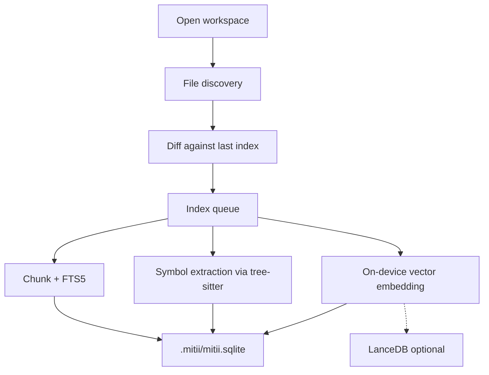

# Context & Indexing

When you ask Mitii to make a change, the agent needs to understand your codebase before it can act. Context indexing is the mechanism that makes this possible: it builds a local, searchable representation of your repository — full-text, structural symbols, and semantic vectors — so the agent can find relevant code quickly without reading every file.

Everything runs on your machine. No source code or index data is sent to external services.

## How indexing works

When you open a workspace, Mitii automatically builds (or updates) the index in four steps:

1. **Discovery** — scans the workspace for indexable files, respecting `.gitignore` and `.mitiiignore`.
2. **Diff** — compares each file's hash and modification time against the previous index (stored in the SQLite `files` table) to identify what is new or changed.
3. **Queue** — parallel workers (default concurrency: 2) pick up new and changed files for processing.
4. **Per-file processing** — each file is split into chunks, indexed for full-text search (SQLite FTS5), parsed with tree-sitter to extract function/class/variable symbols, and optionally embedded into a vector for semantic search.

The result is stored locally in `.mitii/mitii.sqlite` (or `.mitii/lance/` if you use the LanceDB backend).

### Large repositories

For big codebases the pipeline exposes explicit phases so the UI can show progress and you can cancel at any time:

| Phase | What happens | Status values |
|-------|-------------|---------------|
| **Scan** | File discovery + diff; no indexing yet | `scanning` → `scan_complete` |
| **Index** | Chunking, FTS, symbols, vectors | `indexing` → `index_complete` |
| **Cancel** | User-initiated stop | `cancelled` |

If indexing is interrupted or a file exceeds size limits, the index enters **partial-index** status. Already-indexed files remain searchable, and the agent operates in a degraded-but-usable mode rather than blocking.

### Manual re-index

You can trigger a re-index at any time:

- Click the indexing status chip in the sidebar toolbar.
- Command palette: **Mitii: Index Workspace**.

This is useful after large refactors, when you add new directories, or if the index seems stale.

## How the agent uses the index

When the agent needs context during a run, the **Repository Context** module queries multiple sources in parallel (800 ms timeout each):

| Tier | Sources |
|------|---------|
| **Explicit** | Project rules, `@` mentions, skills catalog |
| **Editor** | Current file, open files, workspace overview |
| **Workspace** | Git diff, LSP diagnostics |
| **Search** | Full-text search, indexed file search, vectors, repo map, memory |

Toggle individual sources in **Settings → Context**.

### Reranking & budgeting

Raw retrieval can return more context than the model's window can hold. Mitii applies two passes to select the most useful snippets:

1. **Reranker** — narrows the top 20 candidates down to the top 8 (configurable via `mitii.context.rerankerTopK`).
2. **Window budget** — allocates a token budget per source within the model's context window.

Anything that doesn't fit is dropped and surfaced in the context debugger with a reason.

### Context debugger

Expand **Retrieved context** in the chat sidebar to inspect what the agent actually saw:

- Retrieved vs. included token counts
- Per-source breakdown (FTS, vectors, rules, git, etc.)
- Included snippets with file paths and inclusion reasons
- Dropped items with cause (`over_budget`, `not_selected`)

### Pinned context

If you want the agent to always consider specific files or folders:

- Add them via `@` mentions in the chat input or the context picker.
- Pinned items are always included during retrieval, regardless of relevance scoring.
- They appear in the **Pinned context** panel above the chat input.

### Built-in retrieval tools

During a run, the agent can call these tools to explore the workspace on its own:

| Tool | What it does |
|------|-------------|
| `search` | Full-text / ripgrep query across the workspace |
| `search_batch` | Run multiple search queries at once |
| `retrieve_context` | On-demand hybrid retrieval (FTS + vectors) |
| `repo_map` | PageRank-weighted file listing for structural overview |
| `list_files` | Directory listing |
| `read_file` / `read_files` | Read file contents |
| `propose_file_scope` | Declare candidate file paths before reading or editing (default in Act mode) |

### Repo map

The `repo_map` tool applies PageRank over the import/symbol graph to highlight structurally central files. This is useful when the agent doesn't know where to start exploring — it surfaces the files that most other code depends on.

## Embeddings

Vector embeddings power semantic search — finding code by meaning rather than exact keyword match. Mitii generates embeddings **on-device** using a bundled model, so there are no extra API costs or network round-trips.

| Provider | Description |
|----------|-------------|
| `minilm` (default) | Small local model; good balance of quality and speed |
| `hash` | Deterministic fallback when no model is available |

Vector storage backend:

| Backend | Storage location |
|---------|-----------------|
| `sqlite` (default) | `.mitii/mitii.sqlite` |
| `lancedb` | `.mitii/lance/` (optional, suited for very large repos) |

## Configuration

All indexing settings live under `mitii.indexing.*`:

| Setting | Default | Description |
|---------|---------|-------------|
| `mitii.indexing.enabled` | `true` | Master switch for the index |
| `mitii.indexing.autoIndexOnOpen` | `true` | Index automatically when you open a folder |
| `mitii.indexing.maxFileSizeBytes` | `512000` | Index files up to this size (~500 KB) |
| `mitii.indexing.hardSkipSizeBytes` | `2000000` | Skip files larger than this (~2 MB) entirely |
| `mitii.indexing.vectorsEnabled` | `true` | Enable semantic vector search |
| `mitii.indexing.embeddingProvider` | `minilm` | `minilm` or `hash` fallback |
| `mitii.indexing.vectorBackend` | `sqlite` | `sqlite` or `lancedb` |
| `mitii.indexing.treeSitterEnabled` | `true` | WASM-based symbol extraction |

## Ignore files

Control which files are excluded from indexing:

| File | Purpose |
|------|---------|
| `.gitignore` | Respected by default |
| `.mitiiignore` | Additional Mitii-specific ignores |
| `.thunderignore` | Legacy — still honored for backward compatibility |

## Storage

| Path | Contents |
|------|----------|
| `.mitii/mitii.sqlite` | FTS index, symbols, vectors (sqlite backend), sessions |
| `.mitii/lance/` | Vector data when `vectorBackend: lancedb` |

## Where it lives in the codebase

| Package | Responsibility |
|---------|---------------|
| `@mitii/host` | Filesystem adapters, workspace indexing pipeline, tree-sitter runtime, bundled embeddings |
| `@mitii/v8` | Repository Context module (retrieval, reranking, budgeting), code-navigation, change-impact |
| `@mitii/sdk` | Public API surface for custom hosts |

The host owns the "how to scan and index" logic; V8 owns the "how to retrieve and rank" logic. This separation means the same index works across VS Code, CLI, and any custom host built on `@mitii/sdk`.
